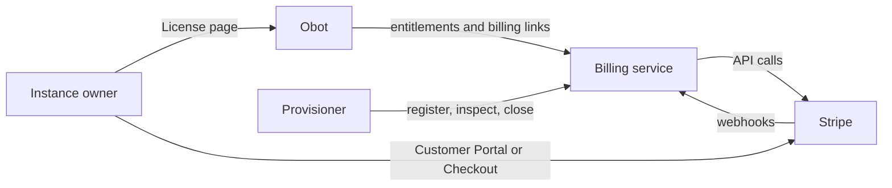

# 2026-09-23: Cloud Billing

- **Authors:** @njhale
- **Created:** 2026-09-23

## Summary

Add subscription billing to Obot Cloud so we can collect recurring payments
for plans priced per user seat. Introduces two Obot Cloud plans, Team and
Business, which bundle different entitlements. Users with the Owner role in an
Obot instance can choose a plan and seat count and manage payment from its
License page.

Stripe will handle subscription management and payment. A new shared billing service
will connect each environment to its Stripe subscription and supply the
entitlements Obot enforces. New environments will start with a 14-day Business trial.

## Related issues

- [obot-platform/obot#8008](https://github.com/obot-platform/obot/issues/8008) —
  Defines the plans, subscription behavior, and environment lifecycle.

## Related ODPs

None.

## Problem and motivation

We want to sell Obot Cloud through plans that package entitlements,
with a monthly charge per user seat. We need a way to present those plans,
collect payment, and let customers change what they buy.

Billing also needs to control what the customer's instance allows. The chosen
plan determines the hosted MCP server and audit retention entitlements; the
purchased seat count determines how many users can join. Subscription changes
must keep those entitlements aligned with what the customer is paying for.

## Goals

- Collect recurring per-seat payment for Obot Cloud plans.
- Let instance owners manage their own subscription: see prices, change plan or
  seats, update payment details, view invoices, and cancel.
- Represent trials and paid plans with the same subscription.
- Make the subscription the only source of an Obot Cloud environment's
  entitlements.
- Apply subscription changes to the environment without operator action.
- Define plans and their entitlements in the payment provider.
- Decide environment cleanup by subscription state.

## Non-goals

- Self-service Enterprise or self-hosted subscriptions. Enterprise remains
  sales-led, licensed through Keygen, and billed outside this flow.
- Usage-based pricing, separately priced hosted MCP add-ons, or shared billing
  across environments.
- Building payment forms or maintaining a plan catalog inside Obot.
- Migrating existing environments to Stripe billing.

## Context and constraints

**Licensing.** For Obot Cloud environments, the subscription's entitlements
replace the license key's user limit and the audit retention settings, and add
a limit on hosted MCP servers. The two sources are never added together, and
the license key still controls everything else. An installation uses its
license alone, as it does today, unless billing is configured and its license
key has the `OBOT_CLOUD` entitlement.

**Access.** In an Obot instance, users with the Owner role can manage the
instance's subscription.

**Credentials.** As a security posture, an environment should avoid holding
broadly scoped payment-provider credentials: ones that could act on other
environments' subscriptions or on the payment platform itself.

**Trials.** A new environment's trial is a subscription like any other. It has
a plan and a seat count, and it sets entitlements the same way. Converting it
keeps the same subscription, and no payment details are needed until then.

**Seats and plans.** Only user seats scale with the number of seats bought.
Hosted MCP servers and audit log retention are fixed by the plan at any seat
count.

**Changes.** Plan and seat changes are prorated and apply immediately.
Cancelling applies at the end of the billing period. Plans are defined in the
payment provider, so editing a plan changes the entitlements of everyone
subscribed to it.

**Downgrades.** A lower plan or seat count, or an edit that lowers a plan,
blocks new users and new hosted MCP servers but keeps existing users and
running servers. Lower retention deletes older audit logs at the next cleanup,
and upgrading again doesn't bring them back.

**Ending.** Cancelling isn't deleting. When a trial or subscription ends, the
environment allows no new users or hosted MCP servers but keeps what it has,
warns every user, and is deleted after a grace period. An environment with a
live subscription is never deleted.

**Outages.** A billing outage isn't a downgrade. The environment keeps its last
known entitlements, including across restarts, and isn't deleted.

## Proposed design

Self-service subscriptions bring together four components:

- **Stripe**, the payment provider: the plan catalog, the subscriptions
  themselves, and the hosted pages where owners pay and manage them.
- **The billing service**, new and shared by Cloud environments: it holds the
  Stripe credentials, gives each environment its own Stripe customer and
  subscription, and turns those subscriptions into the entitlements Obot
  enforces.
- **Obot** gains a billing client. It reads and stores its environment's
  entitlements, enforces user seats, hosted MCP servers and audit log
  retention, and offers **Manage subscription** to instance owners on the
  License page.
- **The provisioner** gains a registration step. It creates each environment's
  billing key, registers the environment before sending the activation email,
  and decides environment cleanup from subscription state.

For each Cloud environment, the provisioner creates a billing key and registers
one Stripe customer with at most one subscription. Stripe owns the plan,
quantity, payment, and subscription status. The billing service keeps a local
copy of that state and translates it into entitlements. Obot stores and
enforces the latest entitlements it receives, while the provisioner uses the
subscription state to decide whether the environment remains live or can be
deleted.



### Billing model

#### Environments, customers, and subscriptions

Each environment gets its own Stripe customer and at most one subscription,
counting trialing and paused subscriptions. All instance owners manage that
subscription. A person managing several environments therefore has separate
payment details and invoices for each environment.

The billing service is shared by all Cloud environments. It creates Stripe
customers and subscriptions, opens hosted billing pages, and translates each
subscription into the entitlements Obot enforces. Obot remains responsible for
enforcement, and the provisioner remains responsible for creating and removing
environments.

#### Plans and entitlement derivation

We will offer two plans, both charged per user seat per month:

| Entitlement         | Team      | Business  |
| ------------------- | --------- | --------- |
| Seats               | 1–10      | 1–100     |
| Hosted MCP servers  | 0         | 10        |
| Remote MCP servers  | Unlimited | Unlimited |
| Audit log retention | 7 days    | 30 days   |

Each plan is represented by a Stripe product with:

- one default price, charged per user seat (unit) per month
- metadata describing the maximum seat count (quantity) and the Obot
  entitlements it provides

```text
Product    Metadata
Team       max_quantity=10   audit_log_retention_days=7
Business   max_quantity=100  audit_log_retention_days=30  hosted_mcp_servers=10
```

Each plan has a single price because the Customer Portal can't change a
subscription that has more than one product.

Plans are managed in the Stripe Dashboard. Editing a product's metadata changes
the entitlements of everyone subscribed to it. To change a price, we add a new
price and make it the product's default. Existing subscribers keep the price
they have.

The billing service derives entitlements from the subscription's quantity,
product metadata, and status. Obot applies them as follows:

| Entitlement         | Comes from                                                                                  | Enforcement                                      |
| ------------------- | ------------------------------------------------------------------------------------------- | ------------------------------------------------ |
| User seats          | The subscription's quantity, from 1 to `max_quantity`                                       | Checked when a user signs in for the first time. |
| Hosted MCP servers  | The product's `hosted_mcp_servers` at any seat count, or 0 if unset                         | Caps the number of running hosted MCP servers.   |
| Audit log retention | The product's `audit_log_retention_days` at any seat count, for both MCP and LLM audit logs | Applied by the audit log cleanup.                |

#### Subscription states

The billing service maps subscription status to environment behavior:

| Subscription or condition      | Environment behavior                                                                                                  |
| ------------------------------ | --------------------------------------------------------------------------------------------------------------------- |
| Trialing, active or `past_due` | Live: keeps its plan's entitlements and isn't deleted.                                                                |
| Paused, unpaid or canceled     | Ended, as described in [Context and constraints](#context-and-constraints). Deleted after a set number of days (TBD). |
| Billing service unreachable    | Keeps its last entitlements and isn't deleted.                                                                        |

When a payment fails, the subscription is `past_due` while Stripe retries it.
If the last retry fails, Stripe's failed-payment setting marks it `unpaid`.

### End-to-end flows

#### Provisioning and trial creation

Provisioning connects the instance to billing before sending its activation email:

1. The [provisioner](https://github.com/obot-platform/obot-provisioner) applies the environment's Terraform workspace. Along with
   the instance, Terraform creates a random **billing key** and configures Obot
   with `OBOT_SERVER_BILLING_URL` and `OBOT_SERVER_BILLING_KEY`. The key is a
   deployment secret identifying this environment to the billing service.
2. The provisioner reads the workspace outputs and sends the environment ID,
   contact email, canonical environment URL, and key hash to the billing
   service's `POST /v1/register`, using its admin token.
3. The billing service creates the Stripe customer and Business trial
   subscription. It saves their association with the environment, the key hash,
   and the initial entitlements before reporting registration success.
4. Obot requests `GET /v1/entitlements` from the billing service using its
   billing key and saves the response. Until initial registration and this first fetch
   succeed, the instance waits and retries rather than becoming ready with
   unrelated default limits.
5. After registration and instance readiness succeed, the provisioner sends
   the activation email. The user can sign in and see the Business trial and
   its end date on the License page.

The environment starts with a 14-day Business trial for 10 seats, without a
payment method. Stripe records the trial's end date, and the trial supplies the
same Business entitlements as a paid subscription. If an instance owner adds a
payment method and changes nothing else, the subscription continues as
Business with 10 seats when the trial ends. If no payment method has been added
by then, Stripe pauses the subscription.

The registration request:

```json
{
  "envId": "env-3f9c2a",
  "email": "owner@example.com",
  "url": "https://env-3f9c2a.obot.ai",
  "billingKeyHash": "9f86d081884c7d659a2feaa0c55ad015a3bf4f1b2b0b822cd15d6c15b0f00a08",
  "billingKeyHashAlgorithm": "sha256"
}
```

#### Synchronizing and enforcing entitlements

The billing service keeps a copy of each environment's Stripe subscription. It
updates that copy when Stripe sends a webhook, after verifying its signature,
and polls Stripe to catch missed webhooks and edits to plans and subscriptions.

Obot polls the billing service's `GET /v1/entitlements` and reads it again when
the License page loads. For example, while an environment is on its initial
trial, the response is:

```json
{
  "plan": "Business",
  "status": "trialing",
  "userSeats": 10,
  "hostedMcpServers": 10,
  "auditLogRetentionDays": 30,
  "trialEnd": "2026-10-07T00:00:00Z",
  "periodEnd": "2026-10-07T00:00:00Z",
  "cancelAtPeriodEnd": false
}
```

Obot saves each response and keeps its entitlements across failed reads and
restarts. The same fields carry the paid plan's values once the trial converts.
The License page shows the plan, its status, seat usage, and the trial or
billing period end. Changes made in Stripe can take a few minutes to appear.

#### Managing a subscription

Owners manage their subscription in Stripe's hosted
[Customer Portal](https://docs.stripe.com/customer-management), where they can
switch plans, change seats, update payment details, view invoices, and cancel.
Stripe handles proration and cancellation at the end of the billing period and
sends webhooks when the subscription changes. We build no payment pages.

Because every environment receives a subscription during registration, owners
also use the portal to convert its trial. They can add payment details and, if
they want, select a different plan and seat count. Conversion updates the
existing subscription. Stripe supports
[collecting payment details for an existing trial through the portal](https://docs.stripe.com/billing/subscriptions/trials/free-trials#use-the-customer-portal-to-collect-payment).

1. An instance owner selects **Manage subscription** on the License page.
2. Obot checks the signed-in user's Owner role, then calls the billing
   service's `POST /v1/manage` with its billing key. The role authorizes the
   person; the key identifies the environment.
3. The billing service answers with a redirect, which Obot passes to the
   browser. The redirect usually goes to a Customer Portal session, such as
   `https://billing.stripe.com/p/session/...`, that is already signed in as the
   environment's Stripe customer.
4. In the portal, the owner adds payment details and, if they want, selects a
   different plan and seat count.

The billing service creates a new session on every click: a session URL expires
a few minutes after it's created, and until then anyone who has it can manage
that environment's billing. For the same reason, session URLs are never stored
or logged.

Changing the plan or seats during the trial ends the trial and bills
immediately. Paid changes are prorated, and cancelling applies at the end of
the billing period.

For example, an environment on Business with 20 users and 10 hosted servers can
downgrade to Team with 5 seats. Existing users and servers remain, new users
and new hosted MCP servers are blocked, and retention drops to 7 days.

The billing service configures plans, seat ranges, paid-change proration, and
period-end cancellation in the portal. The single-item model supports the
portal's
[subscription-update constraints](https://docs.stripe.com/customer-management#limitations).

If opening billing fails, the License page shows an error and the entitlements
don't change.

#### Ending and restarting a subscription

Users with payment trouble can still open billing. In the portal, a paused
subscription resumes when an owner adds a payment method, and an unpaid one
becomes active again when its open invoice is paid. A canceled subscription
requires a replacement, which the portal can't create. For that case, the
redirect goes to the billing service's plan picker instead. The picker link
works once and expires after 30 minutes. Choosing a plan creates a Checkout
session for the environment's existing Stripe customer, without another trial,
and redirects the owner to Stripe's hosted
[Checkout](https://docs.stripe.com/payments/checkout) page. The return URL must
be on the environment's own address, as registered.

#### Closing and deleting an environment

Each night, before it deletes anything, the provisioner reads subscription
state from the billing service through `GET /v1/environments` or
`GET /v1/environment/{id}`, and acts on it as described in
[Subscription states](#subscription-states). It honors manual exemptions. Obot
reads the same state through entitlements.

Before deleting an environment, the provisioner closes its billing through the
billing service's `POST /v1/environment/{id}/close`. The billing service reads
the subscription from Stripe directly. If it's trialing, active or `past_due`,
closing fails and the environment is kept. Otherwise the billing service marks
the environment closed and stops returning billing links for it, and the
provisioner deletes the environment. On its next poll or webhook, the billing
service cancels the subscription, voids its open invoices, and refunds any
payment made after closing.

### Billing service contract

#### Authentication and stored state

Following the credentials posture in
[Context and constraints](#context-and-constraints), the billing service holds
a restricted Stripe API key so individual instances can manage their billing
without receiving access to our Stripe account. Stripe also sends webhooks to
the billing service. Stripe sends every customer's events to each webhook
endpoint, so instances can't receive them without seeing each other's billing.

The billing key is a deployment secret created by the environment's Terraform
workspace. Obot uses it to authenticate to the billing service, which stores
its hash and uses it to identify the environment on every request. The
provisioner uses a separate admin token to register environments and read their
status. Registering an environment again with a new key hash replaces the old
one.

The billing service stores billing-key hashes, Stripe customer and subscription
IDs, and the latest billing state in PostgreSQL.

#### API

All endpoints in this table belong to the billing service:

| Endpoint                          | Caller      | Authentication           | Purpose                                                                                                                                                                             |
| --------------------------------- | ----------- | ------------------------ | ----------------------------------------------------------------------------------------------------------------------------------------------------------------------------------- |
| `GET /v1/entitlements`            | Obot        | Billing key              | Return this environment's plan, entitlements, subscription status, trial and billing period end, and cancellation information.                                                      |
| `POST /v1/manage`                 | Obot        | Billing key              | Redirect to this environment's billing page: a Customer Portal session for its Stripe customer, or the plan picker if its subscription is canceled.                                 |
| `POST /v1/register`               | Provisioner | Admin token              | Register an environment and create its Stripe customer and Business trial. Retries preserve the same account and trial. Registering again with a new key hash replaces the old one. |
| `GET /v1/environments`            | Provisioner | Admin token              | Return subscription state for registered environments, with pagination.                                                                                                             |
| `GET /v1/environment/{id}`        | Provisioner | Admin token              | Return the same billing record for one environment.                                                                                                                                 |
| `POST /v1/environment/{id}/close` | Provisioner | Admin token              | Close an environment's billing before deletion, unless its subscription is trialing, active or `past_due`.                                                                          |
| `POST /v1/stripe/webhook`         | Stripe      | Verified signature       | Tell the billing service that a subscription or payment changed.                                                                                                                    |
| `GET /plans/{token}`              | Browser     | Single-use link          | Use up the link, which expires after 30 minutes, and show the plans for sale.                                                                                                       |
| `POST /plans/checkout`            | Browser     | Cookie set by the picker | Create a Checkout session for the chosen plan and redirect to it.                                                                                                                   |

#### Obot configuration

Obot gets two new environment variables:

- `OBOT_SERVER_BILLING_URL`: the billing service's address.
- `OBOT_SERVER_BILLING_KEY`: the environment's billing key.

Obot turns on billing only when both are set and its license key has the
`OBOT_CLOUD` entitlement. Otherwise it behaves as it does today.

## Alternatives considered

| Alternative                     | Trade-off                                                                                                                                                               |
| ------------------------------- | ----------------------------------------------------------------------------------------------------------------------------------------------------------------------- |
| Billing in the provisioner      | Reuses environment identity and a deployment but puts customer-facing billing APIs alongside infrastructure authority.                                                  |
| Per-environment Keygen licenses | Reuses entitlement delivery but adds another synchronization step. Direct delivery keeps billing state and Cloud entitlements together.                                 |
| Instances call Stripe directly  | Avoids a service, but every instance would hold a Stripe key, which can reach every customer, and would need Stripe's webhooks, which carry every customer's events.    |
| A payment form embedded in Obot | Keeps owners in Obot, but we'd build and maintain payment pages, and still need pages for plan changes, invoices and cancellation, which Stripe's hosted pages provide. |

## Trade-offs

### A separate billing service

Stripe keys and webhooks stay out of instances, and Obot has no Stripe code.
In return, we run another service, and new environments can't finish
provisioning while it's down.

### One Stripe customer per environment

Each environment's billing is separate, and its instance owners manage only
that environment's subscription. An owner of several environments has a
separate customer, payment details and invoices for each.

### No add-ons

An add-on is a second product on the same subscription, priced separately from
the plan, such as extra hosted MCP servers sold per server. The Customer Portal
can't change a subscription that has more than one product; owners could only
cancel it. Offering add-ons would mean building our own pages for changing
subscriptions, so each plan is a single product with fixed entitlements.

## Risks and open questions

We're still evaluating Chargebee as the payment provider. Choosing it would
change the Stripe-specific parts of this design.

## Rollout and migration

1. Deploy the billing service and validate registration, trial creation, and
   hosted billing flows in a Stripe sandbox.
2. Release Obot's billing client, durable entitlements, License page, and
   enforcement support with billing disabled until its settings are supplied.
3. Update provisioning to create the billing key, register the environment, and
   wait for initial entitlements before sending the activation email.
4. Enable paid conversion and billing-based deletion after their open policies
   and failure cases are resolved and tested.

Existing environments aren't migrated.

To roll back, the provisioner stops registering new environments and stops
setting `OBOT_SERVER_BILLING_URL`, so new environments run without billing.
Existing subscriptions keep billing in Stripe until they're canceled.

## Testing and validation

Subscription tests run in a Stripe sandbox.

### Provisioning

- Provision an environment through the activation email and first sign-in.
  Verify its Business trial, entitlements, and end date, without a payment
  method.
- Fail each provisioning step and retry. Verify one customer, one subscription,
  an unchanged trial end, and no activation email until the instance is ready.

### Subscription changes

- Convert a trial, change seats, switch plans, and cancel in the Customer
  Portal. After each change, verify proration and seat ranges in Stripe, and
  that Obot applies the new user seats, hosted MCP server cap, and audit
  retention and shows them on the License page.
- Edit a plan's metadata and change its default price. Verify that existing
  subscribers' entitlements follow the metadata and that they keep their price.
- Downgrade below current usage. Verify that existing users and running servers
  stay, new users and servers are blocked, and older audit logs are deleted.
- Let a trial end without a payment method, then resume it. Let a renewal fail
  until the subscription is unpaid, then pay the open invoice. Verify
  entitlements at each step.
- Cancel and let the billing period end, then resubscribe through the plan
  picker. Verify that no second trial is granted.

### Access

- Verify that only instance owners can open billing, and that one environment's
  billing key can't read or manage another environment.

### Deletion

- Close an environment. Verify that it gets no billing links, that its
  subscription is canceled, and that closing fails for a trialing, active or
  `past_due` subscription.

### Failures and rollback

- Fail Stripe and the billing service separately, and restart Obot. Verify that
  entitlements are kept and no environment is deleted.
- Turn off billing registration in the provisioner. Verify that new
  environments run without billing.

## References

- [Stripe free trials and conversion](https://docs.stripe.com/billing/subscriptions/trials/free-trials)
- [Stripe Checkout](https://docs.stripe.com/payments/checkout)
- [Customer Portal configuration](https://docs.stripe.com/customer-management/configure-portal)
- [Stripe no-code Customer Portal](https://docs.stripe.com/customer-management/activate-no-code-customer-portal)
- [After a payment link payment](https://docs.stripe.com/payment-links/post-payment)
- [Subscription webhooks](https://docs.stripe.com/billing/subscriptions/webhooks)
